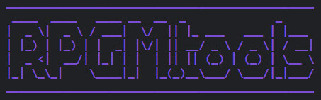

# Random Procedural Names - Foundry Module Quick Start Guide - Version 1.13.0.1

## 1. Introduction

Welcome to the Quick Start Guide for Random Procedural Names. In the ever-evolving universe of Foundry VTT, creativity fuels every compelling narrative and immersive gaming experience. This module is designed to help streamline your creative process and enhance the quality of your TTRPG adventures by automatically generating names and descriptions for your characters and settings.

---

### 1.1 Unleashing Creativity

Our module nurtures your creativity by offering an intelligent solution to character and place naming, freeing you up to delve into the core elements of world-building.

### 1.2 Efficiency and Consistency

Random Procedural Names brings together efficiency and consistency. It is an innovative module designed to reduce the time spent on creating names and descriptions.

### 1.3 A Multifaceted Tool

This tool goes beyond random name generation. It has the capacity to produce procedural homebrew content, including items, spells, feats, and more, and incorporates the powerful knowledge of ChatGPT AI for your TTRPG needs.

---

## 2. Primary Functions

In this section, we'll discuss the core functions of Random Procedural Names and how you can make the most of them.

### 2.1 Generate Names

Names breathe life into your characters and places, making them feel real and memorable. This tool generates names using various methods:

-   **Auto-Name New Tokens**: This setting automatically assigns a name to every new token that you drag onto the canvas.
-   **Refresh Button**: Manually refresh the name of any token using this button on the Token HUD.
-   **Context Menu**: Generate names directly for an actor using the context menu in the Actors sidebar.
-   **Chat Commands**: The **!n** or **!name** command in the chat window generates a name for any specified subject.

**Examples**:
<a href="./img/foundry/cultists.jpg" target=_blank>
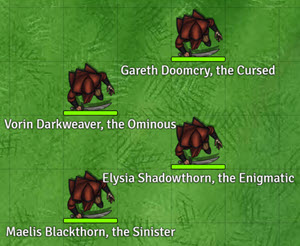
</a>
<a href="./img/foundry/goblinoids.jpg" target=_blank>
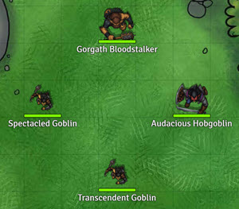
</a>

### 2.2 Homebrew Generation

Random Procedural Names also offers creative homebrew content generation:

-   **Generate Description Button**: Located on the Token HUD, this button creates detailed descriptions for your tokens.
-   **Chat Commands**: The **!d** or **!desc** command generates a description for the selected token based on its name and type. The **!h** or **!home** command creates any kind of homebrew content.

**Examples**:
<a href="./img/foundry/grocer.jpg" target=_blank>
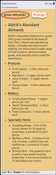
</a>
<a href="./img/foundry/thunderhawk.jpg" target=_blank>
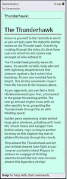
</a>

### 2.3 Chatbot/General Information

The tool offers information and answers to your questions using ChatGPT:

-   **ChatGPT Command**: The **!g** or **!gpt** command in the chat window sends a prompt to ChatGPT. The AI provides a response via whisper in the chat.

**Examples**:
<a href="./img/foundry/thief-weapon.jpg" target=_blank>
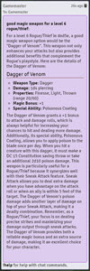
</a>
<a href="./img/foundry/nature-barbarian.jpg" target=_blank>
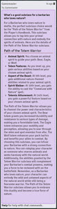
</a>
<a href="./img/foundry/hex.jpg" target=_blank>
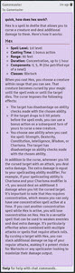
</a>

---

## 3.Settings

Random Procedural Names comes with a host of customizable settings that give you full control over the tool's functionalities. This section is divided into several subsections for easy navigation. **BE SURE TO CONFIGURE THE SETTINGS FOR EACH NAMING METHOD TO USE THE APPROPRIATE GENRE FOR YOUR COMPAIGN BEFORE USING THIS MODULE FOR THE BEST RESULTS.**

### 3.1 Saved Items

**Preference Panel**:
<a href="./img/foundry/saved-items.jpg" target=_blank>
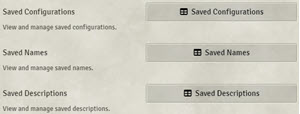
</a>

Saved items are stored in an archive for easy access to previously generated names, descriptions, and configurations. It includes:

-   **Saved Configurations**: View and delete default and custom configurations that have been saved via the refresh button on the Token HUD.
-   **Saved Names**: All AI-generated names are stored here. Names for new tokens can be sourced from this archive under specific conditions mentioned in the tool's settings.
-   **Saved Descriptions**: New token descriptions, in addition to being stored on the actor's sheet, are saved here. You can regenerate or delete these descriptions.

**Preference Panels**:
<a href="./img/foundry/saved-configs.jpg" target=_blank>
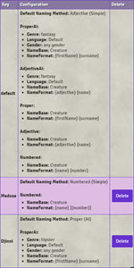
</a>
<a href="./img/foundry/saved-names.jpg" target=_blank>
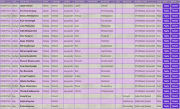
</a>
<a href="./img/foundry/saved-descriptions.jpg" target=_blank>
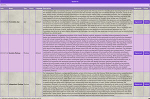
</a>

### 3.2 Naming Settings

Here, you can set parameters that determine how the tool generates names. You can choose naming methods, specify gender, decide on the name base, and more.

**Preference Panel**:
<a href="./img/foundry/naming-settings.jpg" target=_blank>
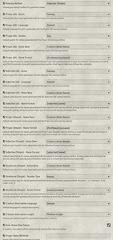
</a>

### 3.3 Creature Description Settings

Customize the generation of creature descriptions. You can choose the language, adjust the length of descriptions, and decide whether to show the description in chat.

**Preference Panel**:
<a href="./img/foundry/description-settings.jpg" target=_blank>
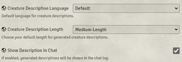
</a>

### 3.4 AI Settings

In AI Settings, fine-tune the AI parameters, including the Patreon Key, Temperature, and API Key.

### 3.5 Other Settings

Additional settings include the Developer Mode option, which can be enabled for extra console information useful for debugging.

---

Random Procedural Names enhances your Foundry VTT experience by enabling a more dynamic, creative, and immersive world-building process. Happy creating!
